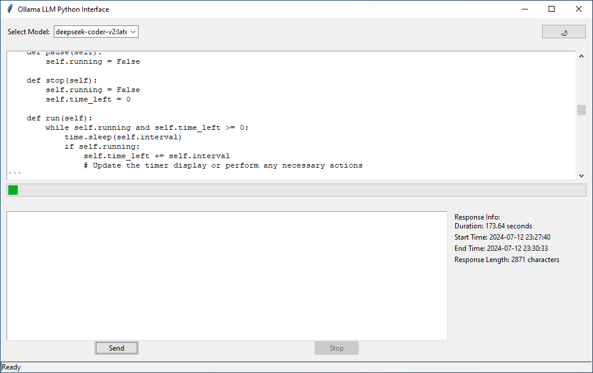

# Ollama LLM Python Interface

A graphical user interface for interacting with Ollama's large language models primarily the coding models such as Deepseeker-v2:latest, built with Python and Tkinter.
Save code blocks to files with the click of a button!

# Project Goals & a tip

Save code blocks to pages in a convenient manner. The use case for the application is someonone who wants to generate applications and save the code blocks locally.
This saves the user from having to manually copy and paste. 

## Features

- Connect to local Ollama instance
- Select from available language models (LLM's)
- Interactive chat interface
- Real-time streaming of AI responses
- Code block detection and saving
- Application will try to auto-detect the filename for the code blocks to the best of its ability
- Once the AI response is completed, then below the response our app will output all the code blocks from which you can choose which or all to save to files somwhere
- Night mode for comfortable viewing (alpha)
- Response information display (start time, end time, length)
- Ability to stop ongoing requests
- Built in debugging

## Tested LLM's include

- Deepseeker-v2:latest
- yabi/codestral_22b_v0_1:q2_k
- shcuchi215/python_code_13b:latest

## Requirements

- Python 3.12+
- Ollama installed and running locally

## Installation

1. Clone this repository:
   git clone https://github.com/yourusername/ollama-llm-interface.git
   cd ollama-llm-interface
2. Install the required packages:
   pip install -r requirements.txt
3. Ensure Ollama is installed and running on your local machine and that you have models downloaded and accessible to Ollama.

## Usage

Run the application:
  python main.py

1. Select a model from the dropdown menu.
2. Type your message in the input box.
3. Click "Send" or press Enter to send your message.
4. The AI's response will appear in the chat display.
5. Code blocks in the response can be saved individually.
6. Use the "Stop" button to interrupt long responses.
7. Toggle night mode with the moon/sun button in the top right.

## Contributing

Contributions are welcome! Please feel free to submit a Pull Request.

## License

This project is licensed under CC0 1.0 Universal license - see the [LICENSE](LICENSE) file for details.

## Acknowledgments

- [Ollama](https://github.com/jmorganca/ollama) for providing the local LLM backend.
- The Python community for the excellent libraries used in this project.
